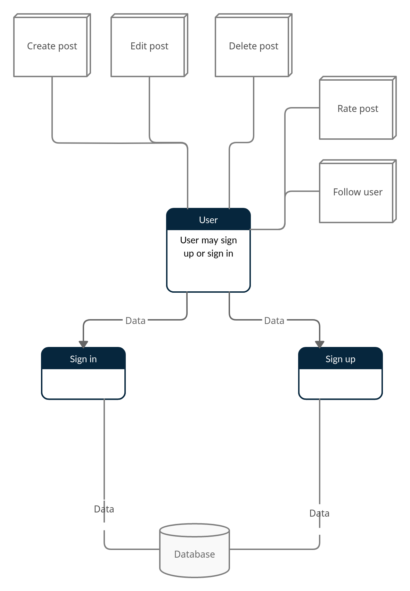

# Hexagon

## Vision

In Hexagon, we thrive to provide the outmost experience for our users, regardless if they are a content creator who shares their own creative work or If they are interested in creative work such as art or short stories.

Hexagon allows the users to expand their audience and fanbase through their creative works, besides, normal users can also benifit from the platform by browsing the site's contents, following others who they are interested in their work.

## Scope (In/Out)

### IN

 1. The web app will let users create posts and add images to them.
 2. The web app will let users edit and delete their own posts.
 3. The web app will let users comment on own and others' posts.
 4. The web app will let users rate others' posts.
 5. The web app will let users follow other users.

### OUT

1. The web app will never have in-app purchase.
2. The web app will.

## Minimum Viable Product vs Strech

### MVP

1. Users can post their work,view others' work, rate and comment on them.

2. Users can follow other users they are interested in their work.

3. The website should be able to display users' posts according to a specific category.

4. The website will be able to notify the user for specific events, such as if someone rated their work.

5. The website should allow the user to create events related to their work, such as artists gathering and art gallery.

### Stretch

1. Videos posting.
2. Live streaming.

## Functional Requirements

1. The user should be able to create posts.

2. The user should be able to edit their own posts.

3. The user should be able to delete their own posts

4. The user should be able to comment on their own and others' posts.

5. The user should be able to follow other users.

6. The user should be able to rate others' posts.

### Data Flow

## Non-Functional Requirements

### Security

- The Web app will have basic authorization and information encryption to protect users from data theft.

### Usability

- The web app will be easy to use.

## Compatibility

- The Web app will be compatible with most systems and browsers that are up to date.
